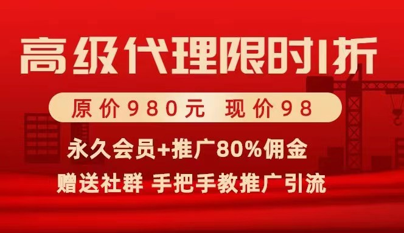
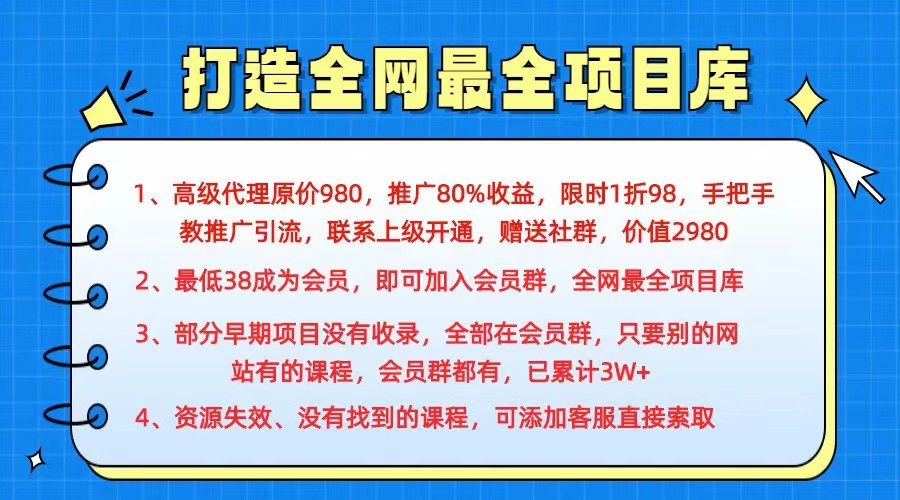
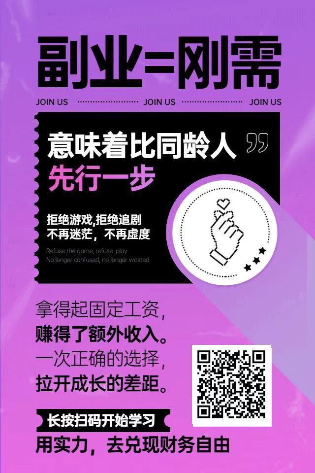
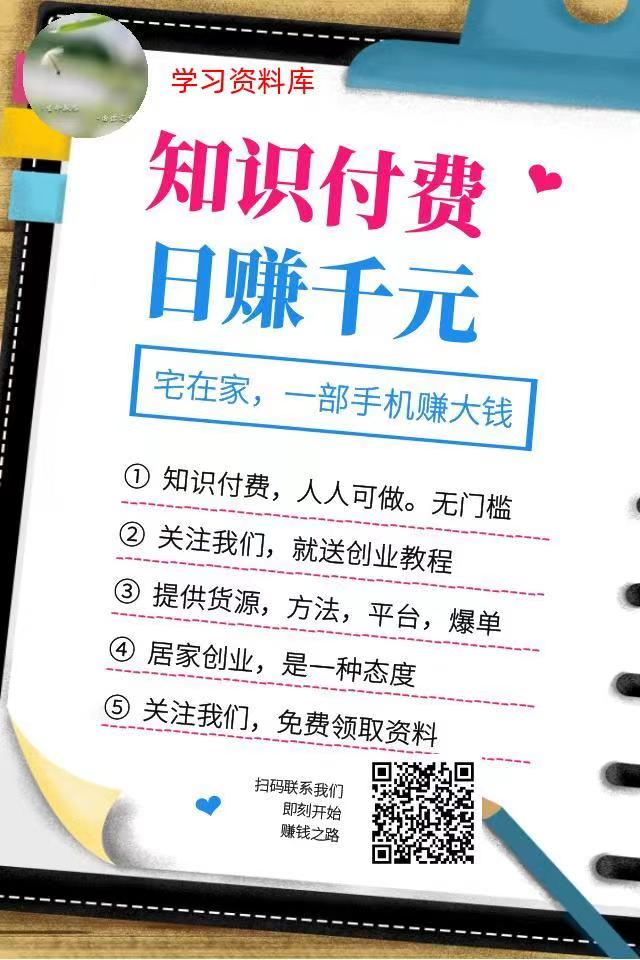
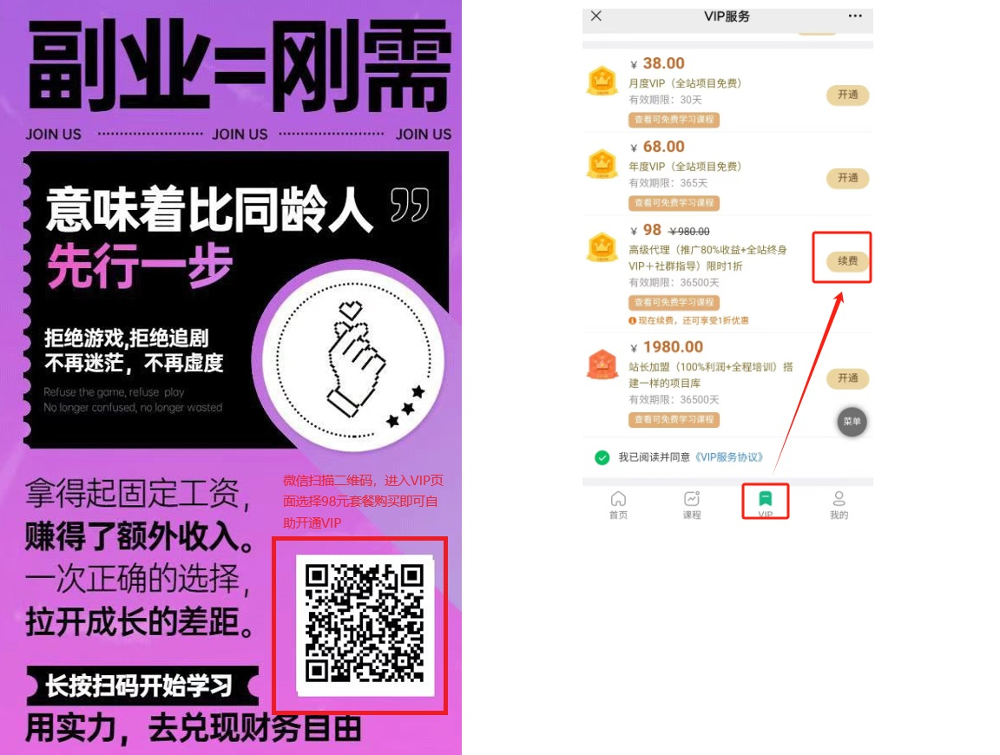

# 资源分类及收费标准

## 资源一: 知识付费-网盘群

价格：**299元/永久会员  588元/永久会员+代理**

详细资源目录可访问：[详细目录](https://path.dirts.cn/z159879991)

### 内容包含：

<b>

**01.成人学习平台**
</b>

    01 豆瓣 
    02 网易云 
    03 知乎 
    04 华尔街学堂 
    05 商学院 
    06 吴小波频道【完更】 
    07 看理想 
    08 许梣全集 
    09 电商淘宝推广等 
    10 抖音短视频等 
    11 湛卢【完结】 
    12 功夫财经 
    13 蜻蜓【完结】 
    14.壹心理 
    16 财经&金融 
    17 keep运动健身【合集】 
    18 办公课 
    19.长投学堂 
    20 参哥课程 
    21抖音专区 
    22.三节课 
    23.壹职场 
    24 老梁故事会【新版】 
    25、少数派 
    26.创业邦 
    27.36 氪 
    28.馒头商学院 
    29.彭小六 
    30 十点课堂 
    31 千聊 
    32 曾仕强合集全套 
    33 荔枝微课 
    35 唯库 
    36 腾讯课堂 
    37 医学养生冥想类 
    38 体制内课程 
    39 国学风水 
    40 极客时间 
    41 B站 
    42 写作阅读读书类 
    43 Excel, word, PPT等 
    44 大师班课程合集 
    45 一书一课 
    46 李笑来的课 
    47 李永乐老师V+ 
    48 齐昊全集 
    49万门大学 
    50摄影专区 
    51 成人英语 
    52 大鹏美术 
    52.B站 
    53 樊登知识超市 
    54 考研数学 
    55 叔贵独创 
    56 四六级英语考试 
    57 徐远观察 
    58 有道精品课 
    59 珍大户-认知世界的经济学 
    60.壹心理 
    61.抖音热门课程合集 
    62、慕课 
    63、馒头商学院 
    64、千 聊 
    65、米课 
    66、890商学院 
    67.插座学院 
    成人终身学习 
    其他精品课 
    英语类 
    整理中的平台 

<b>

**02.亲子平台1**
</b>

    早教课程25个平台
    41.教师课件班主任资源
    40.人教版小初高课件
    39 亲子素材
    38 钢琴基础入门至高级班教程
    37 电子琴教程
    36.【假日博物馆】
    35.未泱阅读
    34.RAZ视频全套
    32.山楂树阅读
    30.奥斯卡英语
    29.【编程scratch】
    28.大陆博士
    27.童行学院
    26.许尤佳育儿
    26.山楂阅读
    24.喜马拉雅亲子
    24.爱豆
    22.【高思数学】
    21.【i陪娃】
    20.【小鱼老师系列】
    20.【火花思维】
    19.哈佛外教百科英语
    19.【李岑老师系列】
    18.樊登小读者
    17.成长兔英语（宝宝玩英语）
    17.【兰登】
    16.【曾曦老师系列】
    15.【海尼曼】
    14.贝壳英语S1
    14.【北外网课】
    13.【你拍一】
    12.【憨爸】
    11.云舒写
    10【完结】童老师牛津阅读树1-9阶
    09.跟谁学
    08.华语未来
    07.米粒妈
    06.摩比
    05.少年商学院
    04.外滩教育
    03.新东方绘本馆
    02.迪士尼电影108部中英字幕
    01.精选英语动画（推荐，已分级）

<b>

**03.小初高1**
</b>

    01.233网校，同桌100语数英1-6年级 
    03.北京四中初中课程 
    04.大鹏书法（毛笔） 
    05.逗你学 
    06.抖音 
    07.高途初中 
    08.高途高中 
    10.高途小学 
    17.螺蛳语文 
    18.蘑菇网校 
    19 猿辅导编程L1-L2 
    19.人教版初中英语 视频 课件等 
    2.花生酥系列 
    20.人教A版高中数学 
    21 有道高中 
    22.书虫【L0-L6】 
    23.孙维刚数学 
    24.小学北师大数学 
    25 有道初中 
    26.新东方新概念英语 
    27 万门初中 
    28.洋葱学院 
    29 万门高中 
    30 万门小学 
    31 学而思2019（新课在学习资料2） 
    9 堂豆学初中化学 
    初中各平台网课 
    高中各平台网课 
    小学生专题大全套 

<b>

**04.会员专区**
</b>
～～大师课V i p 
~~电子书ＶＩｐ 
～～设计V i p 
15西马拉呀 
IT专区 
成人学习平台 
电商专区VIP 
短视频专区 
法律专区 
股票投资专区 
考公考编考教师专区 
考证专区 
网赚副业专区 
心理学会员VIP 
英语专区 
瑜伽健身区 
中医专区 

## 资源二：云海副业平台
价格：**限时98元：推广80%收益+全站终身VIP+社群指导**

**开通指南**
1.自助开通

2.添加微信：LearnDatabase 转账后台开通
## 其他资源： 

### 百度网盘扩容     

价格：**200元/100T/永久**

	流程：
	1.用户提供网盘号
	2.付费
	3.扩容
	4.自己完美存储各种资源

### 至尊课堂  
价格：**39.9元**

目录请移步 [资源列表-至尊课堂](./list/至尊课堂资源目录.md)

### 微淼课堂  
价格：**69.9元**

目录请移步 [资源列表-微淼课堂](./list/目录树：F微淼课程.txt)

### 曾仕强管理系列视频资源 

价格：**69.9元**
	
	共91部 85G资源，购买资源一送该资源

### 袁腾飞全集 

价格：**69.9元**

目录请移步 [资源列表1-腾飞最终版](./list/腾飞最终版目录.txt)
 [资源列表1-袁腾飞全集](./list/目录树：50.袁腾飞.txt)

# 售后服务

<b>

一、购买永久套餐资源可终身学习
</b>

不管你是学生，还是工作党

不管你是自用，还是兼职赚钱

上述套餐都是一个不错的选择。

所有资料永久免费使用，持续更新（每周都会有专人更新）。

<b>

二、免费代更新
</b>

所有资源都有专业团队负责整理更新，可放心使用，网盘群资料定期每月更新一次。

<b>

三、代理资源
</b>

资源允许自行使用，也可以有偿出售给他人，价格你定，收入全归你。
如果要拉其他人进资源群，需要交一部分的管理费，不同的资源不同的收费标准，详情请咨询客服。

# 联系我们

我的微信：**LearnDatabase**

添加请备注：**获取付费资源**

否则不予以通过！！！

百度网盘：**儒雅的学习之路**

添加请备注：姓名+资源类型，否则不予通过

# 百度网盘资源获取流程

1. 添加微信好友，确定资源类型
2. 付款
3. 加百度网盘好友
4. 确认付款信息+网盘好友后，分享对应资源或拉到对应资源群组

具体流程可以参考：[流程](https://www.mubu.com/doc/lfmgdiaVEG)

#科学**上网工具  穿墙   梯子

稳定运行的上网工具，可以用来访问国外的google，youtube等。通过我注册送你3元现金： [链接](https://find.trojanxisbest.top/auth/register?code=NH11)

