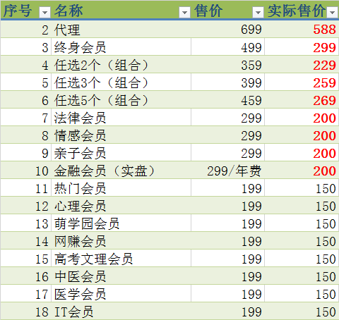

# 资源分类及收费标准

## 资源一: 4000T资源群 

价格：**299元/永久会员  588元/永久会员+代理**

 

详细资源目录可访问：[详细目录](http://xiaobai68.com/share?app=171716161818)

部分资源可以支持单个购买，具体加客服好友咨询。

## 资源二：热门平台会员学习群 
价格：**199 元/永久**

目录可以搜到的资源，有偿分享！全网云课堂学习资源的首选！

热门平台会员学习群目录：[热门平台会员学习群目录](https://share.mubu.com/doc/4HtEFQbvIiG)

## 资源三：考研/考证/公考类 代更新

考研/考证/公考类 资源是每天都有专门团队负责更新，费用及操作流程参考 [学习资料网云盘代更新](https://share.mubu.com/doc/3g_TTWAgz4G)

谢绝不完整的垃圾课程，为你省去大量时间。

## 其他资源： 

### 百度网盘扩容     

价格：**200元/100T/永久**

	流程：
	1.用户提供网盘号
	2.付费
	3.扩容
	4.自己完美存储各种资源

### 至尊课堂  
价格：**39.9元**

目录请移步 [资源列表-至尊课堂](./list/至尊课堂资源目录.md)

### 微淼课堂  
价格：**69.9元**

目录请移步 [资源列表-微淼课堂](./list/目录树：F微淼课程.txt)

### 曾仕强管理系列视频资源 

价格：**69.9元**
	
	共91部 85G资源，购买资源一送该资源

### 袁腾飞全集 

价格：**69.9元**

目录请移步 [资源列表1-腾飞最终版](./list/腾飞最终版目录.txt)
 [资源列表1-袁腾飞全集](./list/目录树：50.袁腾飞.txt)

备注：资源三种会带有部分资源（资源列表1-袁腾飞全集），购买资源三后免费送该部分资源

# 售后服务

<b>

一、购买永久套餐资源可终身学习
</b>

不管你是学生，还是工作党

不管你是自用，还是兼职赚钱

上述套餐都是一个不错的选择。

所有资料永久免费使用，持续更新（每周都会有专人更新）。

<b>

二、免费代更新
</b>

所有资源都有专业团队负责整理更新，可放心使用。

<b>

三、代理资源
</b>

资源允许自行使用，也可以有偿出售给他人，价格你定，收入全归你。
如果要拉其他人进资源群，需要交一部分的管理费，不同的资源不同的收费标准，详情请咨询客服。

# 联系我们

我的微信：**LearnDatabase**

添加请备注：**获取付费资源**

否则不予以通过！！！

百度网盘：**儒雅的学习之路**

添加请备注：姓名+资源类型，否则不予通过

# 资源获取流程

1. 添加微信好友，确定资源类型
2. 付款
3. 加百度网盘好友
4. 确认付款信息+网盘好友后，分享对应资源或拉到对应资源群组

具体流程可以参考：[流程](https://share.mubu.com/doc/lfmgdiaVEG)

#科学**上网工具  穿墙   梯子

稳定运行的上网工具，可以用来访问国外的google，youtube等。通过我注册送你3元现金： [链接](https://find.trojanxisbest.top/auth/register?code=NH11)

